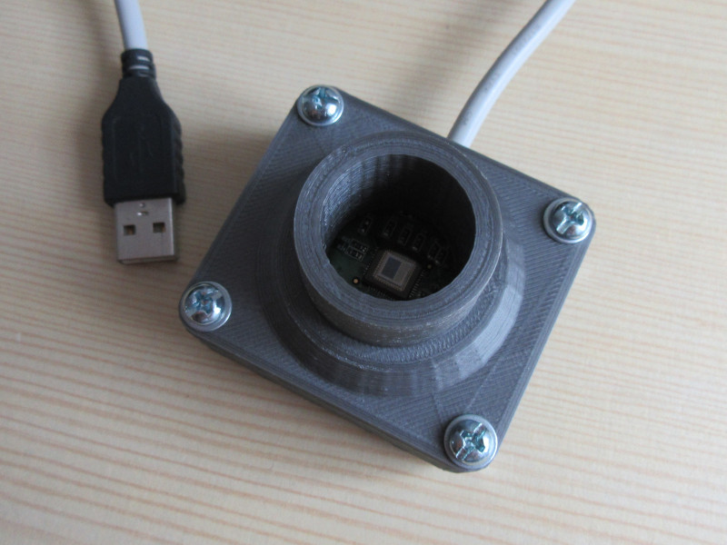

# astrocam case

Using a webcam on a telescope can be a cheap and easy way to get into astrophotography. All there is to do, is to remove the lens of the webcam (the telescope will project the image directly onto the sensor) and mount it to the eyepiece mount. To do that I printed adapter cases which contain the webcams PCB and plug directly onto the standard 1 1/4" eyepiece mount.

These CAD files are examples for cases for the Logitech Express webcam and the Raspberry Pi cam, but the design can easily be adapted for other webcams.

The case consists of three parts:
* an adapter piece that plugs into a standard 1 1/4" eyepiece mount of a telescope
* a frame that holds the PCB with the sensor
* a lid for the back

