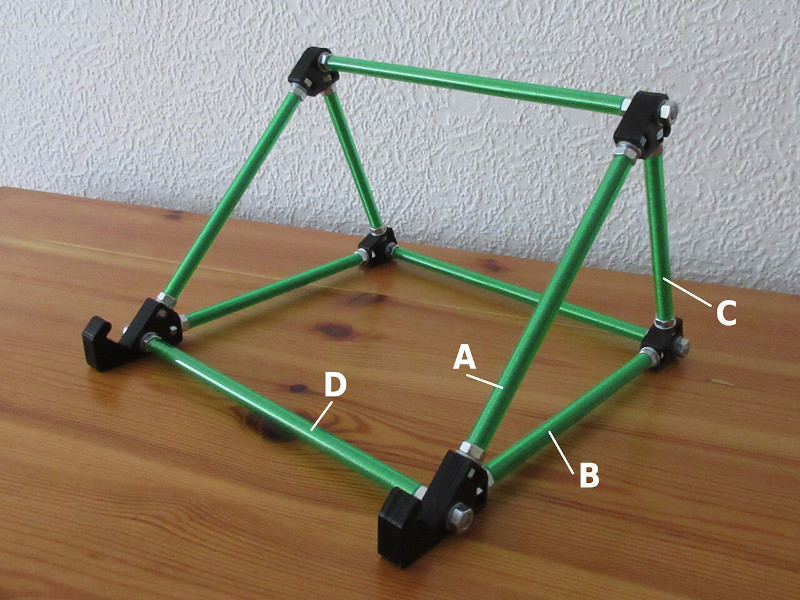

# laptop stand

Raises the screen of the laptop to a more ergonomical height.

## additional parts needed
* 36x M6 nut
* 24x M6 washer
* 4x M6 threaded rod (170 mm) for A and B
* 2x M6 threaded rod (135 mm) for C
* 3x M6 threaded rod (250 mm) for D
* 1x green hose with 6mm inner diameter (optional)
